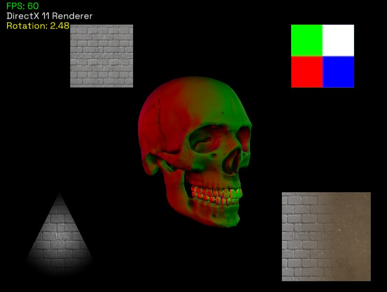

# Direct-X Vault
This project contains my Direct-X 11 examples, the purpose of this project is to experiment with D3D11 API and other Microsoft TKs and compare them against OpenGL and Vulkan.

## Built With
- [CMake](https://cmake.org/)
- DirectX 11, DXGI, D3DCompiler
- C++ 20
- [TinyObj](https://github.com/tinyobjloader/tinyobjloader)
- [TrueType](https://github.com/nothings/stb/blob/master/stb_truetype.h)

## Getting Started
To start simply clone this repository using this command: `git clone "https://github.com/RoastedKaju/D3D11-Demystify.git"`  

In the root folder of this repository open command prompt and generate solution file using Visual Studio using this command: `cmake -B Build`  

This will generate a new folder named `Build` in which you will have `D3D11-Demystify.sln` open it then build and run.

## Features
Currently this project has the following feature set:
- Loading Models
- Loading Images
- Text Rendering
- Alpha Mapping
- Normal Mapping
- Multi-Light Shader
- Multi-Texturing
- Procedural Quads
- Sprite Animations
- Lightmaps